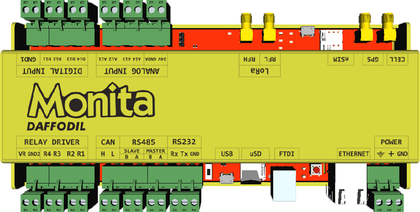

# Monita Daffodil

> Merupakan Modul data akusisi yang dibuat oleh PT. Daun Biru Engineering (Indonesia) yang di gunaakan untuk berbagai kebutuhan monitoring ke beramacam sensor instrument dan di kirimkan ke jaringan internet (IoT)

> Spesifikasi Umum
* Tegangan Suplai 9 - 30 Vdc
* 4 kanal _Input Digital_
* 4 kanal _Output Digital_
* 4 kanal _Input Analog_
* 4G LTE Modem _embedded_ dengan GNSS
* 1 10/100 Ethernet Conection
* USB Tipe A, untuk _Console_ dan _Debugging_
* Konektor SDCard (_Push Push_) 
* Konektor SIMCard (_Push Push_)
* 2 kanal RS485 (Modbus Slave/Master)
* Dimensi 212 x 90 x 20.6 (mm)

