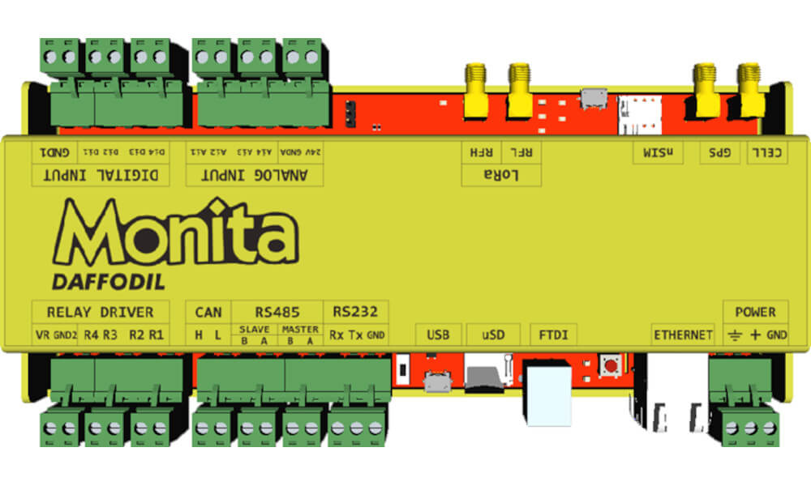

# Monita Daffodil

Adalah sebuah _edge device_ yang berfungsi untuk mengumpulkan dan mengirimkan data melalui jaringan internet. Dengan kemampuan untuk dapat terhubung ke berbagai instrumen sensor, alat yang dibuat dan dikembangkan oleh PT. Daun Biru Engineering ini dapat digunakan untuk memenuhi berbagai kebutuhan _monitoring_ di berbagai jenis industri.

### Spesifikasi Umum

* Dimensi 212 x 90 x 20.6 (mm).
* Tegangan Suplai 9 - 30 VDC.
* I/O:
  * 4 kanal _Digital Input_.
  * 4 kanal _Digital Output_.
  * 4 kanal _Analog Input_.
  * 2 kanal RS485 (Modbus Slave/Master).
* Network:
  * 4G LTE Modem dan GPS (GNSS).
  * 1 10/100 Ethernet Conection.
* USB Tipe B untuk _console_ dan _debugging_.
* Soket _micro_ SD Card untuk penyimpanan data lokal.
* Soket _micro_ SIM Card untuk koneksi ke _cellular network_.
