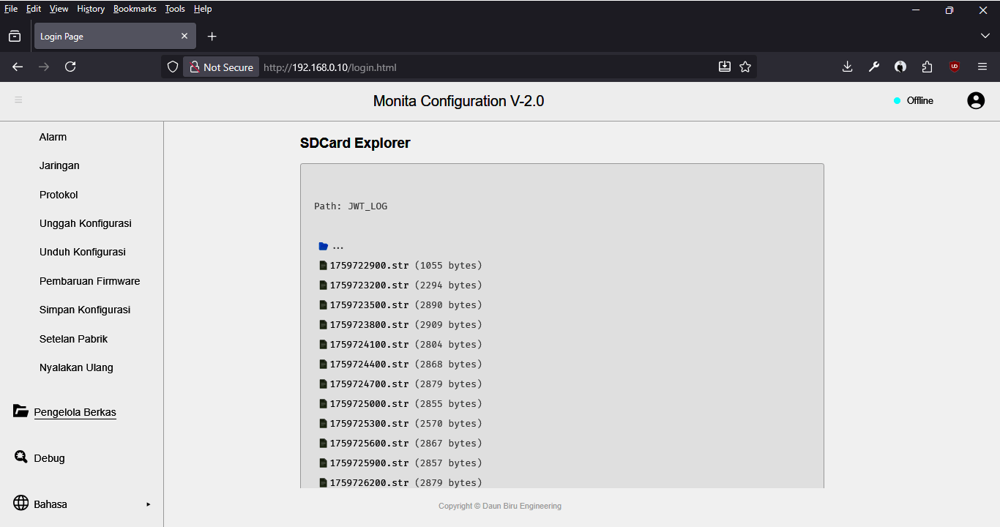

# Pengelola Berkas

Fitur ini berfungsi untuk melihat folder dan file di dalam _micro SD card_. Selain itu, melalui fitur ini Anda dapat juga mengunduh file yang ada di dalamnya secara langsung dan akan tersimpan di ruang penyimpanan PC/Laptop Anda.

Untuk mengunduh file, silakan klik pada nama file. Contoh `1759722900.str`. Umumnya file akan tersimpan di dalam folder `Downloads`.