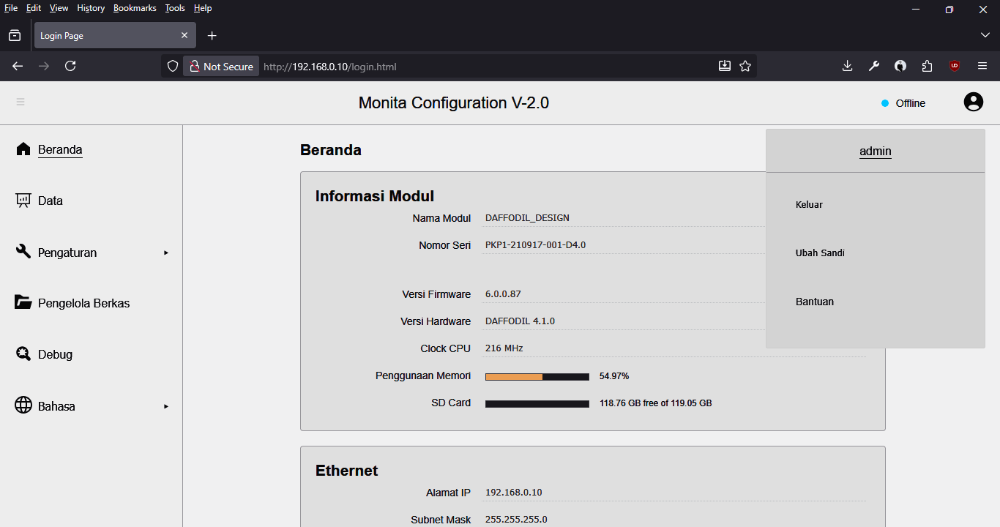

# Beranda

Bila _login_ berhasil, Anda akan masuk ke halaman beranda seperti pada gambar berikut.

### Pilihan Menu

Pada bagian sisi kiri (_sidebar_) terdapat pilihan menu sebagai berikut.

|                    Menu                    |                       Penjelasan                       |
| :----------------------------------------: | :----------------------------------------------------: |
|                  Beranda                   |                Informasi umum _device_                 |
|           [Data](menu/m_data.md)           | Informasi nilai data yang telah diambil atau tersimpan |
| [Pengaturan](menu/pengaturan/m_p_idtag.md) | Pengaturan pengambilan, kalkulasi, dan pengiriman data |
|              Pengelola Berkas              |           Informasi isi data yang tersimpan            |
|                   Debug                    |            Untuk proses _debugging_ proses             |
|                   Bahasa                   |                     Pilihan bahasa                     |

### Jendela Utama

Pada bagian tengah atau jendela utama, terdapat berbagai _section_ informasi sebagai berikut.

##### Informasi Modul

|       Nama        |                       Penjelasan                        |
| :---------------: | :-----------------------------------------------------: |
|    Nama Modul     |                 Informasi nama _device_                 |
|    Nomor Seri     |                 Informasi nomor serial                  |
|  Versi Firmware   |               Informasi versi _firmware_                |
|  Versi Hardware   |               Informasi versi _hardware_                |
|     Clock CPU     |   Informasi frekuensi _clock_ pada _micro controller_   |
| Penggunaan Memori | Informasi RAM yang tersedia dan digunakan oleh _device_ |
|      SD Card      |  Informasi ketersediaan ruang penyimpanan pada SD Card  |

##### Ethernet

|    Nama     |          Penjelasan          |
| :---------: | :--------------------------: |
|  Alamat IP  |     Informasi alamat IP      |
| Subnet Mask | Informasi alamat Subnet Mask |
|   Gateway   |   Informasi alamat Gateway   |
| Alamat MAC  |     Informasi alamat MAC     |

##### Cellular

|       Nama        |                 Penjelasan                 |
| :---------------: | :----------------------------------------: |
|       IMEI        |         Informasi IMEI pada modem          |
|    Status SIM     | Informasi terpasang atau tidaknya SIM Card |
| Penyedia Jaringan | Informasi penyedia layanan yang digunakan  |

### Autentikasi

Untuk mengamankan akses ke _device_, dapat dilakukan pengubahan sandi maupun _logout_.

##### Ubah Sandi

Untuk mengubah sandi, dapat melalui:

- Pilih menu `Ubah Sandi` atau `Change Password`.
- Lalu masukkan sandi baru.

##### Logout

_Device_ akan otomatis _logout_ setelah 15 menit. Untuk menyegerakan _logout_, dapat melalui:

-  Klik menu `Keluar` atau `Logout`.