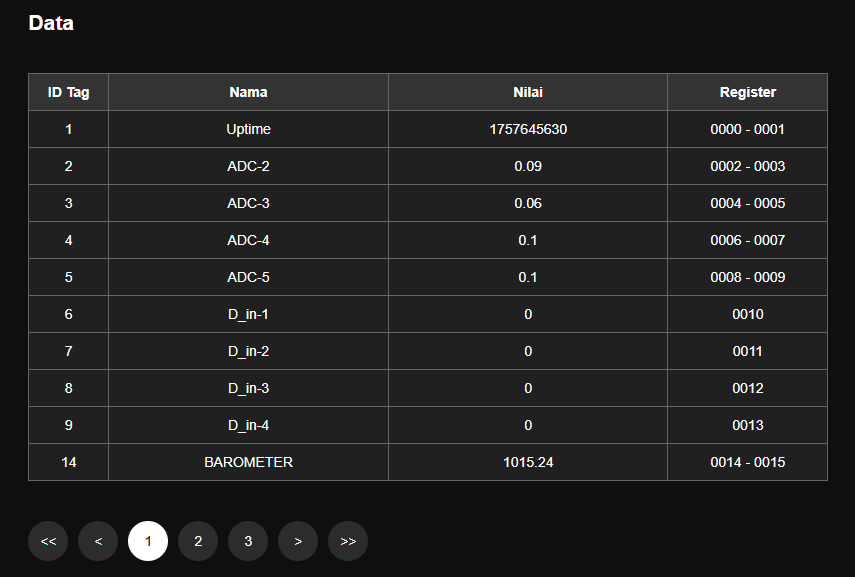

# Data

> Halaman ini digunakan untuk menampilkan data dari titik ukur (ID TAG) yang ada di modul

Detail informasinya:

|Nama|Desc|Remarks|
|:---|:---|:------|
|ID Tag|identitas titik ukur yang miliki oleh modul||
|Nama|Penamaan titik ukur agar pengguna dapat engan mudah mengingat nilai dari data tersebut merupakan nilai dari titik ukur||
|Nilai|Nilai yang tersimpan sesuai dengan nama atau id tag yang telah di tetapkan oleh pengguna||
|Register|Alamat Register untuk keperluan protokol Modbus, sehingga Nilai dapat di ambil oleh device yang lain. |misal : 0000 - 0001, berarti data ini menempati 2 register, yaitu register 0 dan register 1|

> Untuk melakukan pengaturan data register, bisa masuk ke halaman [Pengaturan > Id Tag](../menu/pengaturan/m_p_idtag.md).

