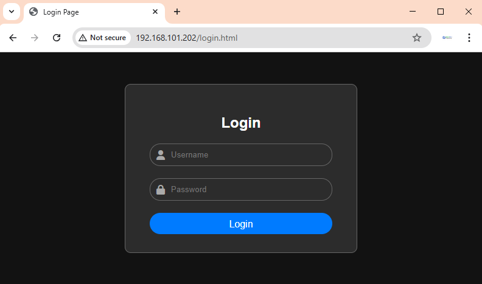

# LOGIN

> Menu ini digunakan untuk Login pengguna ke dalam sistem Daffodil

- Ketik di browser alamat IP Modul
```
http://192.168.0.10/login.html
```
- Setelah load page selesai, akan muncul page berikut.


- Secara default login menggunakan
  - user : admin
  - pass : admin
- <span style="color:red; font-weight:bold">Segera ganti user password tersebut supaya lebih aman</span>

## Logout
- Syetem di Daffodil akan automatis Logout setelah 5 menit

- untuk Logout secara manual, dapat digunakan menu logout. Klik __admin > Logout__ untuk keluar system.
<p align="center">
  
</p>


## Ganti Password
- Untuk mengganti password, buka __admin > Ganti Password__.
<p align="center">
  
</p>

-  Masukkan 
  - username baru
  - password baru
- Klik Change Password.


## Reset
- Apabila lupa password yang digunakan, user dapat melakukan _**hard reset**_ dengan cara menekan switch user selama _**5 menit**_. Kemudian lakukan reboot modul.