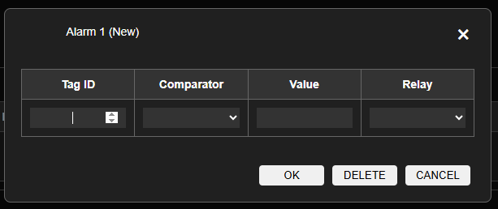

# Pengaturan Alarm

> Konfigurasi Alarm unutk output Digital ke Relay

Untuk membuat konfigurasi baru klik tanda (+), konfigurasi yang diperlukan adalah

|Nama|Desc|
|:---|:---|
|Tag ID|Nilai yang akan di cek dari ID Tag|
|Comparator|Nilai dari ID Tag akan menggunakan oprator yang dipilih <ul><li>==</li><li>></li><li><</li><li>>=</li><li><=</li></ul>|
|Value|Nilai dari ID Tag akan di komparasi dengan nilai ini|
|Relay|Output kanal relai yang akan dihidupkan apabila hasil komparasi nilai bernilai benar |

- klik OK kalau ingin simpan
- klik Delete apabila ingin menghapus konfigurasi
- klik Cancel apabila membatalkan melakukan konfigurasi 

> Setelah data selesai tekan tombol Simpan lalu Semua perubahan perlu di simpan ke memori flash lalu Simpan Konfigurasi agar konfigurasi disimpan secara permanen.
