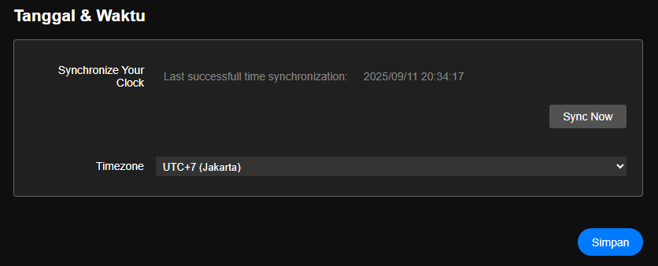

# Pengaturan Tanggal dan Waktu

> Pengaturan ini digunakan untuk melakukan konfigurasi timezone unutk menyesuaikan lokasi modul dipasang.

- Tombol Sync Now untuk sinkronisasi waktu modul ke server NTP.
- Timezone digunakan untuk konfigurasi timezone yang sesuai dengan lokasi modul