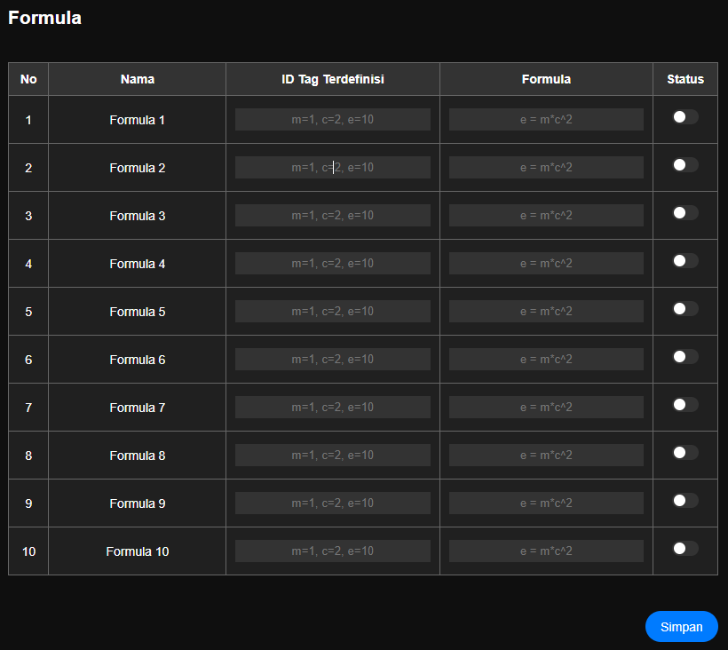

# Pengaturan Formula

> Pengaturan Modifikasi nilai dengan penggunaan formula Matematika sederhana

Pengaturan yang dilakukan

|Nama|Desc|Keterangan|
|:---|:---|:---|
|Nama|Penamaan formula agar mudah diidentifikasi | 
|ID Tag Terdefinisi|Paramater ID Tag yang nanti digunakan sebagai variabel dalam formula metematika.   parameter variabel input dan parameter variabel hasil| m=10,c12,e=15   <ul><li>variable **m** dari value _ID Tag: **10**_ </li><li>variable **c** dari value _ID Tag: **12**_ </li><li>variable (result) **e** ke value _ID Tag: **15**_ </li><ul>| 
|Formula|formula matematika yang digunakan | __e = m\*c^2__   hasil dari __m\*c^2__ akan di simpan di **e**|
|Status|mengaktifkan atau menonaktifkan formula| On/Off|

> Setelah data selesai tekan tombol Simpan lalu Semua perubahan perlu di simpan ke memori flash lalu Simpan Konfigurasi agar konfigurasi disimpan secara permanen.

