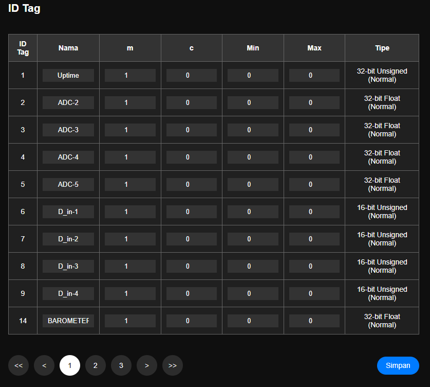

# Pengaturan ID Tag

> Halaman yang digunakan untuk melakukan pengaturan data dari semua ID Tag

Id Tag dibagi dalam beberapa kategori
- Data Uptime/Epochtine Now
- Kanal Input Analog, id tag 2,3,4,5
- Kanal Input Digital, id tag 6,7,8,9
- id Tag untuk holding Register

#### Konfigurasi data tag
|Nama|Desc|Remark|
|:---|:---|:-----|
|Id Tag| No Id Tag | tidak bisa di rubah, sudah ditetapkan di module daffodil|
|Nama|Penamaan sesuai kebutuhan pengguna|dapat di rubah pengguna. max 30 char|
|m|Gradien/Slop. Faktor pengali terhadp perubahan nilai X|Regresi Liner|
|c|Intercept. Nilai perubahan terhadap sumbu Y |Regresi Linier|
|Min|Batas nilai bawah||
|Max|Batas nilai atas||
|Tipe|Informasi tipe data dari nilai id tag|tidak bisa dirubah|

> Setelah data selesai tekan tombol Simpan lalu Semua perubahan perlu di simpan ke memori flash lalu Simpan Konfigurasi agar konfigurasi disimpan secara permanen.

