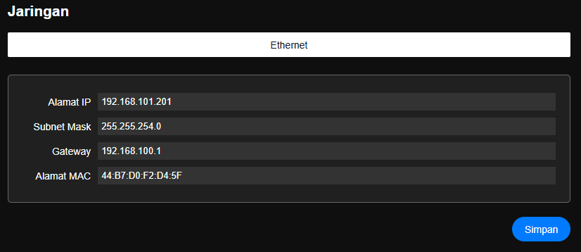

# Pengaturan Jaringan

> Konfigurasi Jaringan Ethernet untuk merubah atau update IP, Netmask maupun Gateway

| Nama | Desc| Nilai|
|:--|:--|:--|
|Alamat IP|IP |192.168.0.10|
|Netmask|SubNet Mask|255.255.255.0|
|Gateway|Gateway|192.168.0.1|
|Alamat MAC|MAC address TCP IP|Auto terisi| 

> Setelah data selesai tekan tombol Simpan lalu Semua perubahan perlu di simpan ke memori flash lalu Simpan Konfigurasi agar konfigurasi disimpan secara permanen.

