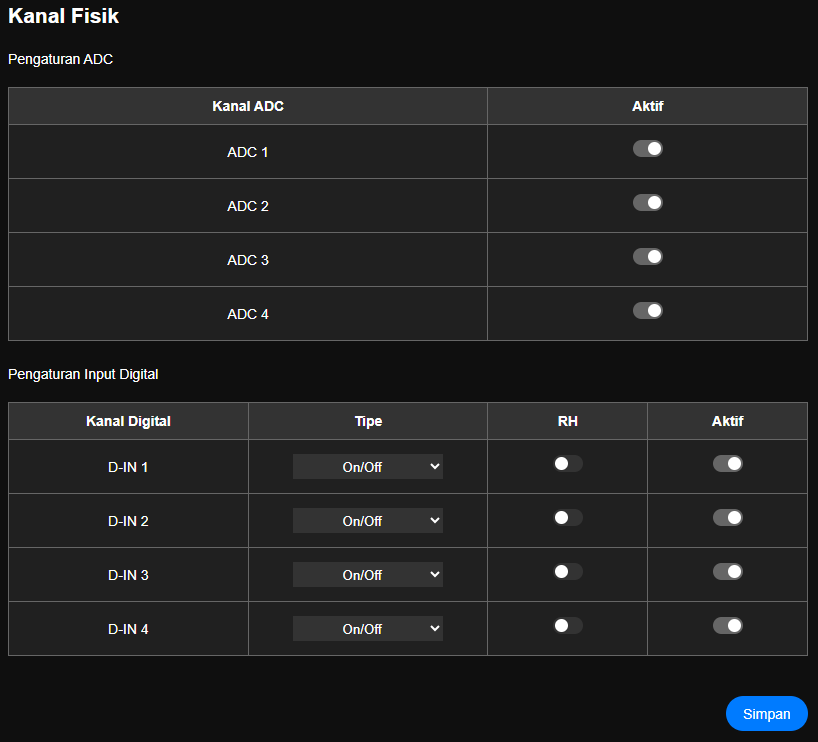

# Pengaturan Kanal Fisik

> Halaman ini digunakan untuk konfigurasi kanal fisik yang ada modul daffodil. ada kanal input analog maupun kanal input digital

### Pengaturan ADC (Input Analog)

|Nama|Desc|
|:---|:---|
|Nama Kanal ADC |ada 4 kanal input  __ADC1, ADC2, ADC3, ADC4__|
|Aktif|Aktifasi setiap kanal.  __Aktif/NonAktif__|

> note: jika kanal ADC dimatikan, maka di menu [Data](menu/m_data.md), data ADC tidak akan di tampilkan, dan register yang asalnya digunakan untuk ADC aktif akan digunakan oleh data berikutnya.

### Pengaturan Diskrit (Input Digital)

|Nama|Desc|
|:---|:---|
|Kanal Digital|Nama masing masing kanal digital  __D-IN 1, D-IN 2, D-IN 3, D-IN 4__|
|Tipe|Tipe input diskrit akan di gunakan sebagai tipe data apa.   <ul><li> On/Off (data 0 dan 1) </li><li>RPM (data putaran per menit)</li><li>Counting</li></ul> |
|RH|dapat diaktifkan jika input ini digunakan unutk menghitung hitung _**Running Hours (RH)**_ dari semua mesin.|
|Aktif|pengaturan mengaktifkan atau menonaktifkan kanal ini.  __Aktif/NonAktif__|

> note: jika kanal diskrit dimatikan, maka di menu [Data](menu/m_data.md), data diskrit/digital tidak akan di tampilkan, dan register yang asalnya digunakan untuk input digital aktif akan digunakan oleh data berikutnya.