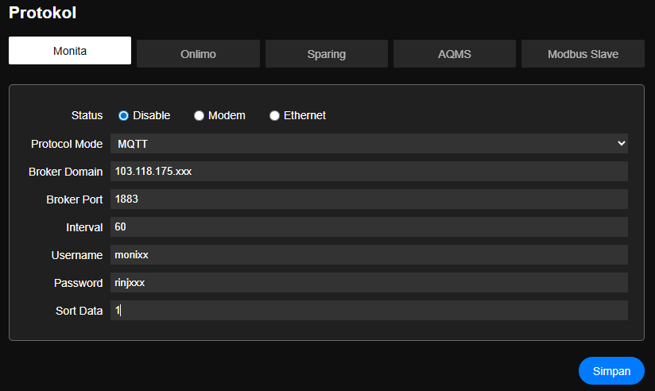

# Pengaturan Protokol

> Konfigurasi beberapa protokol pengiriman data yang dapat dilakukan oleh Modul Daffodil

#### Pengaturan Protokol Monita

|Nama|Deskripsi|Keterangan|
|:---|:---|:---|
|Status|Pilihan pengiriman protokol.  <ul><li>Disable</li><li>Modem</li><li>Ethernet</li></ul>|
|Protokol Mode| Pilih Mode pengiriman yang digunakan.  <ul><li>REST API</li><li>MQTT</li></ul>|  |

- Jika dipilih __REST API__
|Nama|Deskripsi|Keterangan|
|:---|:---|:---|
|Domain|Alamat DNS atau IP Server Monita| |
|Port  |No Port | http (80)  https (443) |
|Interval | Interval pengiriman data dalam __detik__ | |
|Sort Data| Urutan ID Tag yang akan dikirimkan ke server| misal : 1,2,3 |

- Jika dipilih __MQTT__
|Nama|Deskripsi|Keterangan|
|:---|:---|:---|
|Broker Domain| Alamat Broker| |
|Broker Port | No Port Broker| mqqt (1883)   mqqts (8883)|
|Interval| Interval pengiriman data dalam __detik__ | |
|Username| Username broker MQTT | |
|Password| Password broker MQTT | |
|Sort Data| Urutan ID Tag yang akan dikirimkan ke server| misal : 1,2,3 |

#### Pengaturan Protokol Onlimo

|Nama|Deskripsi|Keterangan|
|:---|:---|:---|
|Status|Pilihan pengiriman protokol.  <ul><li>Disable</li><li>Modem</li><li>Ethernet</li></ul>|
|Domain|Alamat DNS atau IP Server ONLIMO | sesuai dokumen ONLIMO |
|Port|No Port | http (80)  https (443) |
|Interval | Interval pengiriman data dalam __detik__ | |
|ID Stasiun | ID Stasiun ONLIMO | sesuai dokumen ONLIMO |
|API URL | path dari DNS | sesuai dokumen ONLIMO |
|API KEY | key protokol ONLIMO | sesuai dokumen ONLIMO |
|API Secret | secret protokol ONLIMO | sesuai dokumen ONLIMO |
|Sort Data| Urutan ID Tag yang akan dikirimkan ke server| misal : 1,2,3 |

#### Pengaturan Protokol Sparing

|Nama|Deskripsi|Keterangan|
|:---|:---|:---|
|Status|Pilihan pengiriman protokol.  <ul><li>Disable</li><li>Modem</li><li>Ethernet</li></ul>|
|Domain|Alamat DNS atau IP Server SPARING | sesuai dokumen SPARING |
|Port|No Port | http (80)  https (443) |
|Interval | Interval pengiriman data dalam __detik__ | |
|UID | UID SPARING | sesuai dokumen SPARING |
|Get URL | path protokol Get SPARING | sesuai dokumen SPARING |
|Post KEY | path protokol Post SPARING | sesuai dokumen SPARING |
|Sort Data| Urutan ID Tag yang akan dikirimkan ke server| misal : 1,2,3 |

#### Pengaturan Protokol AQMS

|Nama|Deskripsi|Keterangan|
|:---|:---|:---|
|Status|Pilihan pengiriman protokol.  <ul><li>Disable</li><li>Modem</li><li>Ethernet</li></ul>|
|Protokol Mode|Pilih Mode AQMS yang digunakan.  <ul><li>PORTABLE</li><li>FIX STATION</li></ul>|  |
|Domain|Alamat DNS atau IP Server AQMS | sesuai dokumen AQMS |
|Port|No Port | http (80)  https (443) |
|Interval | Interval pengiriman data dalam __detik__ | |

- Jika dipilih __PORTABLE__

|Nama|Deskripsi|Keterangan|
|:---|:---|:---|
|Kode Jadwal|Kode protokol AQMS | sesuai dokumen AQMS |
|API URL | path url protokol AQMS | sesuai dokumen AQMS |
|API KEY | key protokol AQMS | sesuai dokumen AQMS |
|API Secret | secret protokol AQMS | sesuai dokumen AQMS |
|Sort Data| Urutan ID Tag yang akan dikirimkan ke server| misal : 1,2,3 |

- Jika dipilih __PORTABLE__

|Nama|Deskripsi|Keterangan|
|:---|:---|:---|
|Username|username protokol AQMS | sesuai dokumen AQMS |
|Password|password protokol AQMS | sesuai dokumen AQMS |
|API Auth | path url auth protokol AQMS | sesuai dokumen AQMS |
|API Data | path url data protokol AQMS | sesuai dokumen AQMS |
|ID Station | kode station protokol AQMS | sesuai dokumen AQMS |
|Sort Data| Urutan ID Tag yang akan dikirimkan ke server| misal : 1,2,3 |

#### Pengaturan Modbus Slave ID

|Nama|Deskripsi|Keterangan|
|:---|:---|:---|
|Slave ID| Id slave dari protokol modbus | default : 1 |
|Baudrate | Baduarte serial Modbus | default : 9600 |

> Setelah data selesai tekan tombol Simpan lalu Semua perubahan perlu di simpan ke memori flash lalu Simpan Konfigurasi agar konfigurasi disimpan secara permanen.