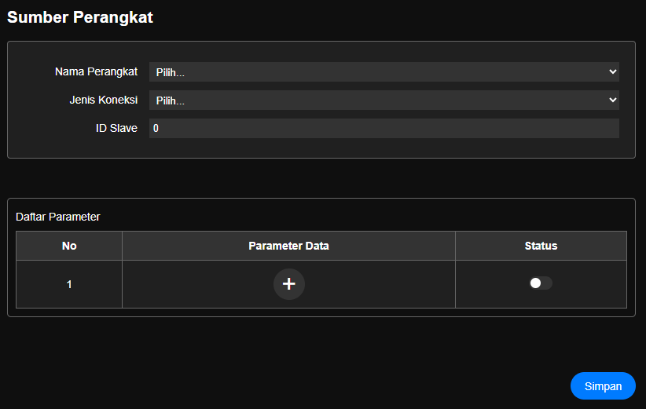
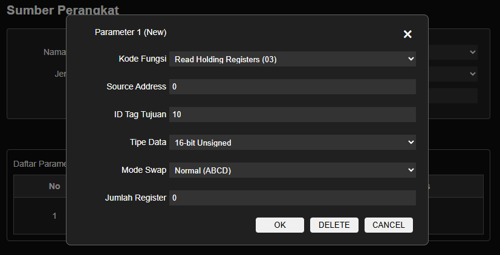

# Pengaturan Sumber Perangkat

> Menu ini digunakan untuk mengambil data protokol Modbus dari device lain ke modul daffodil. Protokol yang dapat di hubungkan adalam Modbus-RTU dan Modbus-TCP

### Daftar Perangkat

|Nama|Desc|
|:--|:--|
|Nama Perangkat|Disediakan maksimal 10 perangkat yang dapat terkoneksi ke modul daffodil, pilih satu nama.   <ul><li>Device1</li><li>Device2</li><li>Device3</li><li>dst ...</li></ul>|
|Jenis Koneksi|jenis protokol yang digunakan.  __Modbus RTU / Modbus TCP__| 
|ID Slave|id slave dari prangkat yang terkoneksi|

##### Parameter Data yang diambil

Di daftar parameter tekan tombol (+) untuk tambah konfigurasi parameter

parameter yang di konfigurasi.

|Nama|Desc|
|:--|:--|
|Kode Fungsi|kode fungsi dari protokol modbus. <ul><li>Read Coil (01)</li><li>Read Descret Input (02)</li><li>Read Holding Registers (03)</li><li>Read Input Registers (04)</li><li>Write Single Coil (05)</li><li>Write Multiple Coil (0F)</li><li>Write Multiple Registers (10)</li></ul>|
|Source Address|Register Addess dari data yang akan diambil|
|ID Tag Tujuan|Data yang diambil tersebut akan disimpan di ID Tag yang ada di Modul. Pastikan lihat dulu di [Data](menu/m_data.md) untuk ID Tag yang tidak digunakan |
|Tipe Data|Data yang diambil akan disimpan dalam format  <ul><li>16-bit Signed</li><li>16-bit Unsigned</li><li>32-bit Signed</li><li>32-bit Unsigned</li><li>32-bit Float</li><li>64-bit Signed</li><li>64-bit Unsigned</li><li>64-bit Double</li></ul> |
|Mode Swap|Swap data  <ul><li>Normal (ABCD)</li><li>Swap Byte (BADC)</li><li>Swap Word (CDAB)</li><li>Swap Byte & Word (DCBA)</li></ul>|
|Jumlah Register|jumlah data yang diambil oleh modul|

- Pilih OK apabila parameter sudah benar.
- Pilih Delete apabila parameter tidak digunakan.
- Setelah semua benar, tekan tombol Status On dan Simpan, agar data mulai ditarik oleh modul daffodil
- Untuk melihat data berhasil diambil oleh modul, pengguna dapat memantau halaman [Data](menu/m_data.md)
- Apabila ingin menambah lagi di __Device__ yang sama, pengguna bisa tambahkan lagi parameter dengan konfigurasi parameter seperti diatas.

> Setelah data selesai tekan tombol Simpan lalu Semua perubahan perlu di simpan ke memori flash lalu Simpan Konfigurasi agar konfigurasi disimpan secara permanen.

