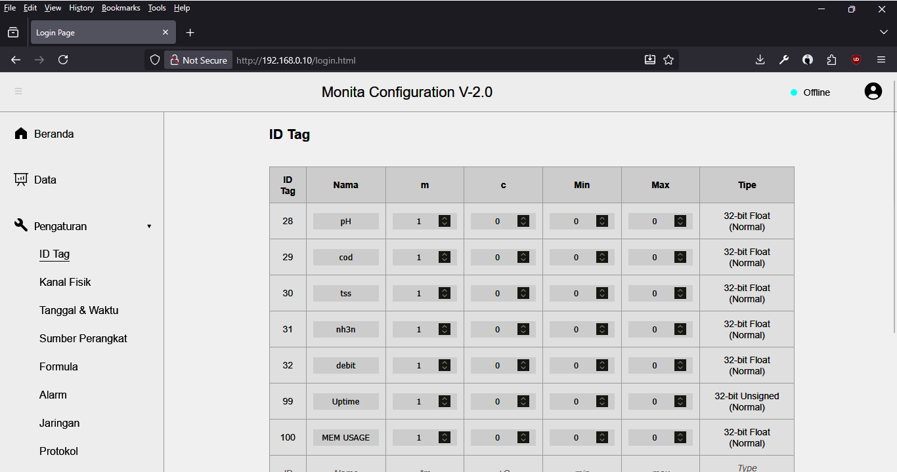

# Protokol SPARING/WQMS

SPARING merupakan singkatan dari Sistem Pemantauan Kualitas Air Limbah Secara Terus Menerus dan Dalam Jaringan. Bisa juga disebut sebagai WQMS atau _Water Quality Management System_. Protokol "SPARING/WQMS" di dalam _device_ Monita Daffodil mengacu pada dokumen SPARING yang dikeluarkan oleh KLHK.

### Pengaturan Protokol SPARING/WQMS

| Nama      | Deskripsi                                 | Keterangan                                      |
| :-------- | :---------------------------------------- | :---------------------------------------------- |
| Status    | Tidak aktif/Aktif                         | _Toggle_ kiri tidak aktif; _toggle_ kanan aktif |
| Domain*   | Alamat DNS atau IP Server SPARING         | Alamat server penerima data                     |
| Port*     | HTTP Port                                 | 443 untuk *https* (_Default_), 80 untuk *http*  |
| Interval* | Jeda pengiriman data                      | Satuan detik; _Default_ 3600 (1 Jam)            |
| UID*      | UID SPARING                               | ID unik _logger_                                |
| Get URL*  | _Endpoint_ protokol GET SPARING           | Untuk mengambil sandi; Misal: `/get-secret`     |
| Post URL* | _Endpoint_ protokol POST SPARING          | Untuk mengirim data; Misal: `/data`             |
| Sort Data | Urutan ID Tag yang akan dikirim ke server | Misal: `28,29,30,31,32`                         |

##### Keterangan:
*) Sesuai dokumen SPARING

##### Catatan:

- Pastikan `nama tag` sesuai dengan dokumen SPARING. Hal ini penting karena `nama tag` akan dikirimkan ke `server`. Penamaan yang salah akan menyebabkan data tidak disimpan ke `server`. Sebagai contoh, berdasarkan dokumen SPARING sebelumnya, `nama tag` adalah:
  - `pH`
  - `cod`
  - `tss`
  - `nh3n`
  - `debit`
- Informasi `datetime` akan otomatis disertakan oleh sistem _device_.
- Bidang isian `Sort Data`, nilai disesuaikan dengan urutan `tag`. Misal: `28,29,30,31,32`.

Sebagai referensi, lihat juga gambar berikut sebagai contoh pengaturan `ID Tag`.

