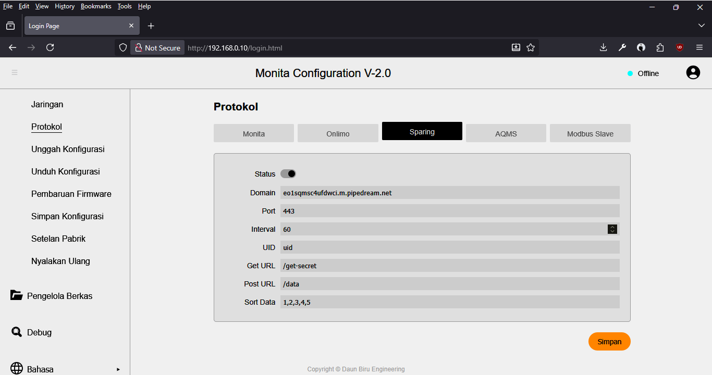

# Protokol SPARING/WQMS

SPARING merupakan singkatan dari Sistem Pemantauan Kualitas Air Limbah Secara Terus Menerus dan Dalam Jaringan. Bisa juga disebut sebagai WQMS atau _Water Quality Management System_. Protokol "SPARING/WQMS" di dalam _device_ Monita Daffodil mengacu pada dokumen SPARING yang dikeluarkan oleh KLHK.

### Pengaturan Protokol SPARING/WQMS

| Nama      | Deskripsi                                 | Keterangan                                      |
| :-------- | :---------------------------------------- | :---------------------------------------------- |
| Status    | Tidak aktif/Aktif                         | _Toggle_ kiri tidak aktif; _toggle_ kanan aktif |
| Domain*   | Alamat DNS atau IP Server SPARING         | Alamat server penerima data                     |
| Port*     | HTTP Port                                 | 80 untuk *http*, 443 untuk *https*              |
| Interval  | Jeda pengiriman data                      | Satuan detik                                    |
| UID*      | UID SPARING                               | ID unik _logger_                                |
| Get URL*  | _Endpoint_ protokol GET SPARING           | Untuk mengambil sandi; Misal: `/get-secret`     |
| Post URL* | _Endpoint_ protokol POST SPARING          | Untuk mengirim data; Misal: `/data`             |
| Sort Data | Urutan ID Tag yang akan dikirim ke server | Misal: 1,2,3,4,5                                |

##### Keterangan
*) Sesuai dokumen SPARING