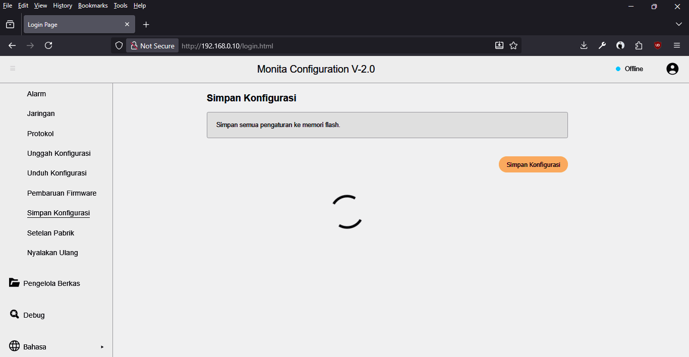

# Simpan Konfigurasi

Halaman ini berfungsi untuk menyimpan semua perubahan pengaturan di semua halaman pengaturan.

Untuk melakukannya, cukup menekan tombol `Simpan Konfigurasi` lalu tunggu hingga _loading indicator_ menghilang.