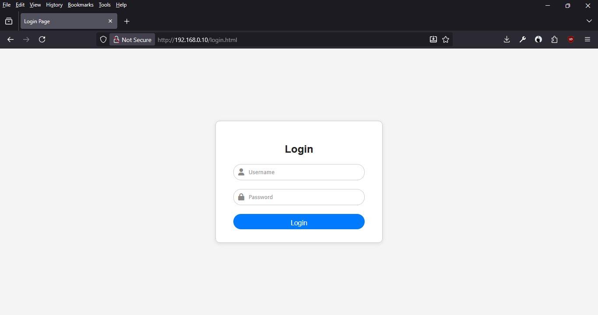

# Login Device

Untuk mulai melakukan konfigurasi, masuk ke dalam aplikasi `web based` melalui _internet browser_ dengan alamat `http://192.168.0.10` atau bila IP sudah diubah, gunakan `http://<CUSTOM_IP>`.

Default akses:
  - Username: `admin`
  - Password: `admin`

Segera ganti `password` untuk lebih aman.
